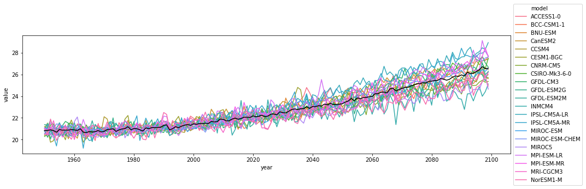
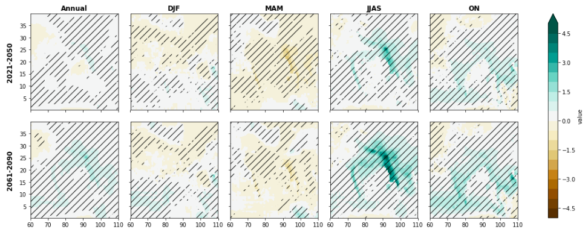
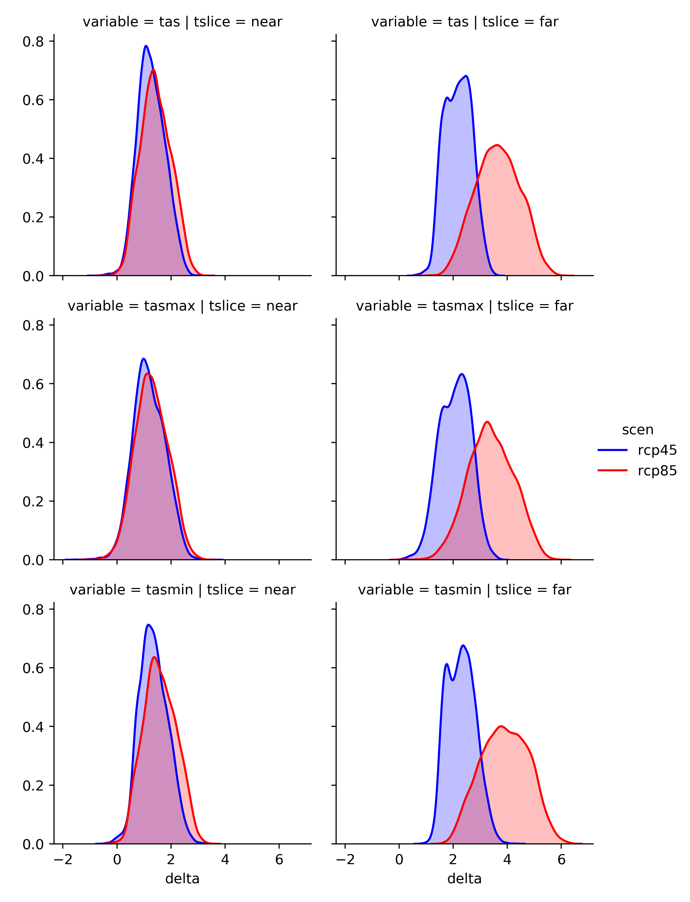
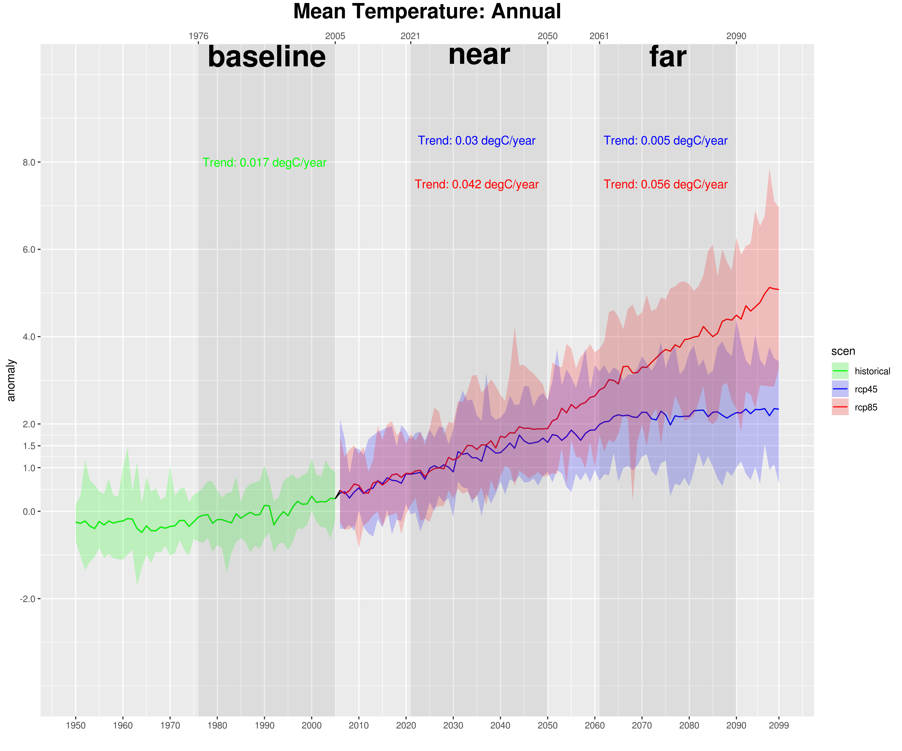

# Statistical downscaled projections from an ensemble of regional climate models (NASA-NEX-GDDP)
The NASA Earth Exchange Global Daily Downscaled Projections (NEX-GDDP) dataset is comprised of downscaled climate scenarios for the globe that are derived from the General Circulation Model (GCM) runs conducted under the Coupled Model Intercomparison Project Phase 5 (CMIP5) and across two of the four greenhouse gas emissions scenarios known as Representative Concentration Pathways (RCPs). The CMIP5 GCM runs were developed in support of the Fifth Assessment Report of the Intergovernmental Panel on Climate Change (IPCC AR5). The NEX-GDDP dataset includes downscaled projections for RCP 4.5 and RCP 8.5 from the 21 models and scenarios for which daily scenarios were produced and distributed under CMIP5. Each of the climate projections includes daily maximum temperature, minimum temperature, and precipitation for the periods from 1950 through 2100. The spatial resolution of the dataset is 0.25 degrees (~25 km x 25 km). 

## Data Analysis

- Analyzed large atmospheric science ensemble simulation datasets using Dask for lazy loading in memory-constrained systems, xarray for Multi-Dimensional Data, pandas and numpy for data analysis, and various visualization tools (matplotlib, seaborn, plotly) in Python
- Implemented ICCLIM and CLIMDEX indices to provide projections on climate extremes
- Assessed the statistical signifance of simulations of 21 statistically downscaled Ensemble models and provided projections for anomaly for all the four variables 
- Time series analyses of 21 models of ensemble projections

## Results

### NASA-NEX-GDDP Ensemble projections 

### Ensemble mean projection of anomalies

The significance level of the t-test procedure are marked by * = 0.1, \*\* = 0.05, *** = 0.01

| variable   | ('historical', 'baseline')   | ('rcp45', 'near')   | ('rcp45', 'far')   | ('rcp85', 'near')   | ('rcp85', 'far')   |
|:-----------|:-----------------------------|:--------------------|:-------------------|:--------------------|:-------------------|
| pr         | -0.006(±0.008)               | 0.008(±0.008)*      | 0.007(±0.007)*     | 0.009(±0.01)*       | 0.008(±0.011)      |
| tas        | 0.017(±0.005)***             | 0.03(±0.005)***     | 0.005(±0.003)***   | 0.042(±0.004)***    | 0.056(±0.004)***   |
| tasmax     | 0.016(±0.005)***             | 0.029(±0.006)***    | 0.002(±0.004)      | 0.039(±0.005)***    | 0.054(±0.005)***   |	
| tasmin     | 0.019(±0.005)***             | 0.031(±0.004)***    | 0.007(±0.003)***   | 0.046(±0.004)***    | 0.059(±0.004)***   ||

### Ensemble mean change projection for the IPCC RCP scenarios over the Indian Region

Regions statistically significant at 0.05 are shaded. The colorbar provided the scale of change in mm/day.

### Distribution of future Ensemble Mean projections for IPCC RCP scenarios

### Time series of Ensemble Mean projections for IPCC RCP scenarios

